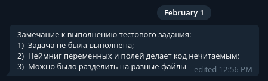

# Kraken Public API

Project structure
```
├── README.md
├── src
│   ├── config.py
│   ├── data
│   │   └── kraken_trades_data.txt
│   ├── main.py
│   └── static
│       └── kraken.db
└── md5sum(Тестовое задание .pdf) -> c43f04b21cb2cf24d2b0608a8ef8e827
```

Start project
```console
cd src && python3 main.py
```

API Endpoint (running on http0.9 not http1.1)
```console
curl --get --http0.9 http://localhost:80/btc-usd
```

Dependencies
```console
python3 -V  # Python 3.9.9
```

Development OS
```console
uname -a    # Linux secret 5.15.0-kali2-amd64 #1 SMP Debian 5.15.5-2kali2 (2021-12-22) x86_64 GNU/Linux
```

#### Code review notes

