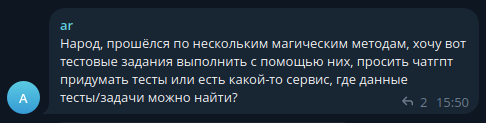
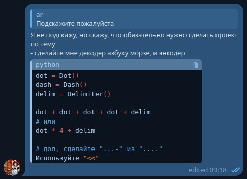

# Morse Code
```python
class Dot: pass
class Dash: pass
class Delimiter: pass
class Character: pass
class Characters: pass

# Character from Dots and Dashes
# Delimiter as a Code stop \n|\0

# TODO
# __mul__
# __add__
# __eq__
# __contains__

# Generate a Character and then use it to check
# - Save and Load Characters ?!
```

## Context

