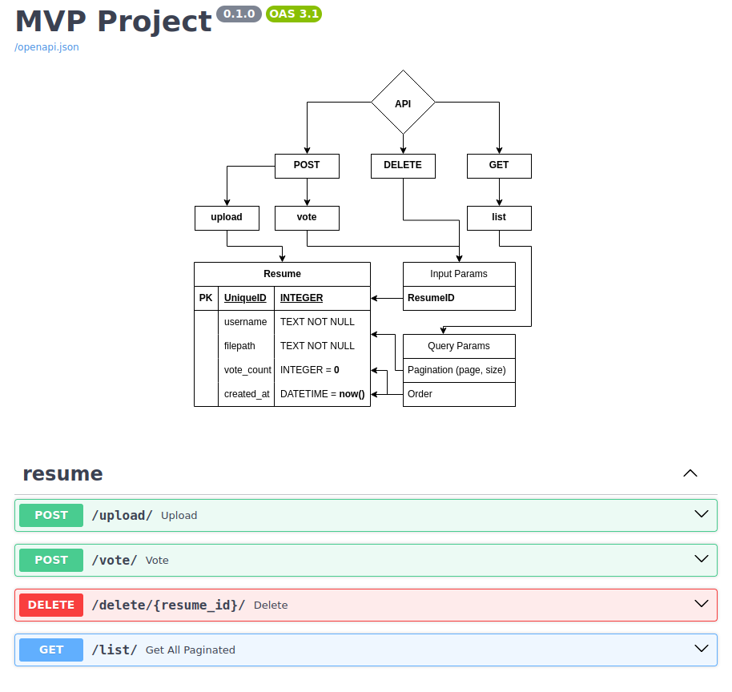

## MVP Project
<h5>Поставленные задачи к проекту</h5>
<ul>
  <li>Реализовать API для сохранения резюме и имя претендента</li>
  <li>Реализовать систему рейтинга для резюме проставляемого пользователем</li>
</ul>

<h5>Использованные технологии для разработки</h5>
<ul>
  <li>FastAPI <sup>[1]</sup></li>
  <li>FastAPI Pagination <sup>[2]</sup></li>
  <li>SQLAlchemy <sup>[3]</sup></li>
  <li>PostgreSQL <sup>[4]</sup></li>
  <li>Pydantic <sup>[5]</sup></li>
</ul>

<h5>Использованные технологии для контейнеризации и изолированного запуска</h5>
<ul>
  <li>Uvicorn <sup>[6]</sup></li>
  <li>Docker <sup>[7]</sup></li>
  <li>Docker Compose <sup>[8]</sup></li>
</ul>

## Запуск проекта
<details>
<summary>Зависимости проекта</summary>
<pre>
docker --version              # Docker version 27.2.1, build 9e34c9b
poetry -V                     # Poetry (version 1.8.3)
poetry run uvicorn --version  # Running uvicorn 0.31.0 with CPython 3.11.6 on Linux
poetry run python -V          # Python 3.11.6
</pre>
</details>

<details>
<summary>Файловая структура проекта</summary>
<pre>
tree -a -I "__pycache__|__init__.py|.idea" --dirsfirst
.
├── data
│   ├── api.png
│   └── ProjectStructure.drawio
├── secret
│   ├── .env-backend
│   └── .env-postgresql
├── src
│   ├── resume
│   │   ├── crud.py
│   │   ├── enums.py
│   │   ├── models.py
│   │   ├── router.py
│   │   ├── schemas.py
│   │   └── utils.py
│   ├── config.py
│   ├── database.py
│   ├── dependencies.py
│   ├── lifespan.py
│   └── main.py
├── static
│   ├── docs
│   │   └── ProjectStructure.drawio.png
│   └── resume
├── docker-compose.yml
├── Dockerfile
├── main.py
├── poetry.lock
├── pyproject.toml
├── README.md
└── md5sum(Task.txt) -> 425f4ea9633ec41cc120f1b236c4fcf0
</pre>
</details>

```bash
docker compose up --build
```
- Проект будет доступно по ссылке: [http://0.0.0.0:8000/docs](http://0.0.0.0:8000/docs)
  - `POST /upload/` - Принимает файл и имя претендента, сохраняет их
  - `POST /vote/` - Увеличивает голоса (`vote_count`) резюме
  - `DELETE /delete/<resume_id>/` - Удаляет резюме из базы и удаляет файл
  - `GET /list/` - Выводит пагинированный список резюме

## Замечание от автора проекта
- Система рейтинга реализован через ендпоинт `/vote/`
  - Доступно через ендпоинт `/list/`,
    - передачей Query-параметра `order_by=vote_count`
- `APIDOG` не был заполнен и передан
- Ендпоинт `/list/` не выдаёт ID резюме
- Резюме из папки `static` доступно по `/static/`
  - `/code/static/resume/<filename>`
  - `http://0.0.0.0:8000/static/resume/<filename>`
  - Файлы будут удалены после завершения проекта (контейнера)

---
<p align="center"></p>

### Ссылки
- [1] https://fastapi.tiangolo.com
- [2] https://uriyyo-fastapi-pagination.netlify.app
- [3] https://www.sqlalchemy.org
- [4] https://hub.docker.com/_/postgres
- [5] https://docs.pydantic.dev/latest
- [6] https://www.uvicorn.org
- [7] https://docs.docker.com
- [8] https://docs.docker.com/compose
- [FastAPI best practices](https://github.com/zhanymkanov/fastapi-best-practices)
- [Full-Stack FastAPI template](https://github.com/fastapi/full-stack-fastapi-template)
- [Draw.io](https://www.drawio.com/doc)
