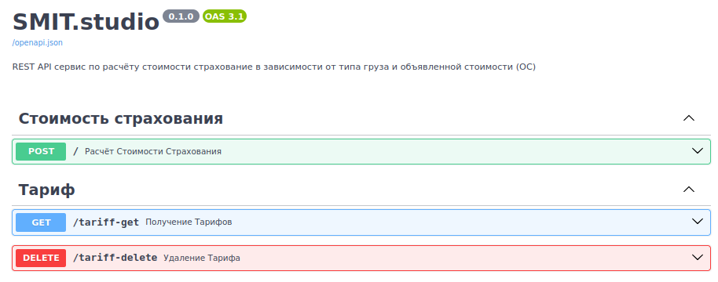

# SMIT.studio

REST API сервис по расчёту стоимости страхование<br />
в зависимости от типа груза и объявленной стоимости (ОС)

### Развёртывание проекта с помощью Docker
<details>
<summary>Зависимости</summary>
<pre>
docker --version    # Docker version 27.3.1, build ce12230
poetry -V           # Poetry (version 1.8.3)
python -V           # Python 3.11.6
pytest -V           # pytest 8.3.3
</pre>
</details>

```bash
docker build -t insurance-cost-rest-api .
docker run -p 8000:8000 -it insurance-cost-rest-api
```
- Будет доступно по ссылке: [http://0.0.0.0:8000/docs](http://0.0.0.0:8000/docs)
  - `POST /` - Расчёт стоимости страхования
  - `GET /requests` - Запросы по расчёту стоимости страхования

Запустить локально
```bash
poetry install
poetry run fastapi run src/app.py
```

### Запуск тестов проекта
```bash
poetry install --with test
poetry run pytest
```
- Тестов нужно запускать до работы с проектом (не разобрался с `conftest`)
  - Связано с тем, что есть тест на проверку файла с тарифом
  - Плюс, для теста и проекта используется одна база

### Замечание
- В базе хранятся только истории запросов с расчётом
  - Не разобрался какие "Данные должны храниться в базе данных"
  - Подумал что это может быть тариф, но уже после "выполнение" ТЗ

<details>
<summary>Пример "истории запросов" (после запуска тестов)</summary>
<pre>
[
  {
    "id": 3,
    "cargo_type": "Glass",
    "declared_value": 33.45,
    "cost_of_insurance": 1.338,
    "insurance_rate_date": "2020-06-01",
    "insurance_rate": 0.04,
    "request_dt": "2024-11-19T10:20:27.479731",
    "response_dt": "2024-11-19T10:20:27.479876"
  },
  {
    "id": 2,
    "cargo_type": "Glass",
    "declared_value": 33.45,
    "cost_of_insurance": 1.338,
    "insurance_rate_date": "2020-06-01",
    "insurance_rate": 0.04,
    "request_dt": "2024-11-19T10:20:27.474687",
    "response_dt": "2024-11-19T10:20:27.474782"
  },
  {
    "id": 1,
    "cargo_type": "Glass",
    "declared_value": 33.45,
    "cost_of_insurance": 0.335,
    "insurance_rate_date": "2020-06-01",
    "insurance_rate": 0.01,
    "request_dt": "2024-11-19T10:20:27.464233",
    "response_dt": "2024-11-19T10:20:27.464301"
  }
]
</pre>
</details>

---

<details>
<summary>Файловая структура проекта</summary>
<pre>
tree -a -I "__pycache__|__init__.py|.idea|.pytest_cache|data" --dirsfirst
.
├── src
│   ├── core
│   │   ├── config.py
│   │   ├── dependencies.py
│   │   ├── lifespan.py
│   │   └── schemas.py
│   ├── database
│   │   ├── app.py
│   │   ├── crud.py
│   │   └── models.py
│   ├── static
│   │   └── sqlite3.db
│   ├── app.py
│   └── utils.py
├── tests
│   ├── conftest.py
│   └── test_app.py
├── Dockerfile
├── .dockerignore
├── .gitignore
├── poetry.lock
├── pyproject.toml
└── README.md
</pre>
</details>

<details>
<summary>Использованные технологии для разработки</summary>
<ul>
  <li>FastAPI<sup>1</sup></li>
  <li>SQLAlchemy<sup>2</sup></li>
  <li>sqlite3<sup>3</sup></li>
  <li>Pydantic<sup>4</sup></li>
  <li>pytest<sup>5</sup></li>
</ul>
</details>

<details>
<summary>Использованные технологии для контейнеризации и изолированного запуска</summary>
<ul>
  <li>Docker<sup>6</sup></li>
</ul>
</details>

#### Ссылки по технологиям
- <sup>1</sup>https://fastapi.tiangolo.com
- <sup>2</sup>https://www.sqlalchemy.org
- <sup>3</sup>https://www.sqlite.org
- <sup>4</sup>https://docs.pydantic.dev/latest
- <sup>5</sup>https://docs.pytest.org/en/stable
- <sup>6</sup>https://docs.docker.com

---
<p align="center"></p>
