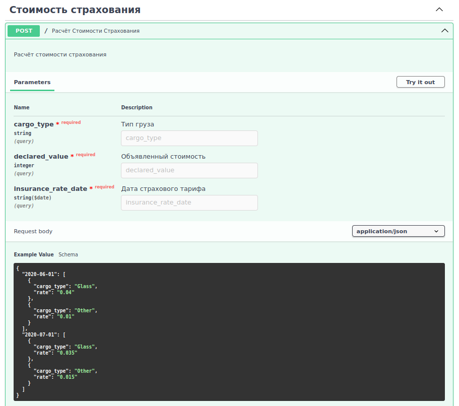

# SMIT.studio

REST API сервис по расчёту стоимости страхование<br />
в зависимости от типа груза и объявленной стоимости (ОС)

### Развёртывание проекта с помощью Docker-Compose
<details>
<summary>Зависимости</summary>
<pre>
docker --version    # Docker version 27.3.1, build ce12230
poetry -V           # Poetry (version 1.8.3)
python -V           # Python 3.11.6
pytest -V           # pytest 8.3.3
</pre>
</details>

```bash
docker compose up --build
```

- **Swagger UI** будет доступно по ссылке: [http://0.0.0.0:8000/docs](http://0.0.0.0:8000/docs)
  - `POST /` - Расчёт стоимости страхования
  - `GET /tariff-get` - Запрос на получение тарифов
  - `DELETE /tariff-delete` - Запрос на удаление тарифа

### Запуск тестов проекта
```bash
docker compose run broker
poetry install --with test
poetry run fastapi run src/app.py
poetry run pytest
```
- Тестов нужно запускать до работы с проектом
  - Связано с тем, что база одна, и есть тест на проверку (и создание) тарифов

---

<details>
<summary>Файловая структура проекта</summary>
<pre>
tree -a -I "__pycache__|__init__.py|.idea|.pytest_cache|data" --dirsfirst
.
├── src
│   ├── core
│   │   ├── config.py
│   │   ├── dependencies.py
│   │   ├── lifespan.py
│   │   └── schemas.py
│   ├── database
│   │   ├── app.py
│   │   ├── crud.py
│   │   └── models.py
│   ├── logging
│   │   ├── app.py
│   │   └── kafka.py
│   ├── static
│   │   └── sqlite3.db
│   └── app.py
├── tests
│   ├── conftest.py
│   └── test_app.py
├── docker-compose.yml
├── Dockerfile
├── .dockerignore
├── .gitignore
├── poetry.lock
├── pyproject.toml
├── README.Docker.md
└── README.m
</pre>
</details>

<details>
<summary>Использованные технологии для разработки</summary>
<ul>
  <li>FastAPI<sup>1</sup></li>
  <li>SQLAlchemy<sup>2</sup></li>
  <li>sqlite3<sup>3</sup></li>
  <li>Pydantic<sup>4</sup></li>
  <li>pytest<sup>5</sup></li>
  <li>Apache Kafka<sup>6</sup></li>
</ul>
</details>

<details>
<summary>Использованные технологии для контейнеризации и изолированного запуска</summary>
<ul>
  <li>Docker<sup>7</sup></li>
  <li>Docker-Compose<sup>8</sup></li>
</ul>
</details>

#### Ссылки по технологиям
- <sup>1</sup>https://fastapi.tiangolo.com
- <sup>2</sup>https://www.sqlalchemy.org
- <sup>3</sup>https://www.sqlite.org
- <sup>4</sup>https://docs.pydantic.dev/latest
- <sup>5</sup>https://docs.pytest.org/en/stable
- <sup>6</sup>https://kafka.apache.org
- <sup>7</sup>https://docs.docker.com
- <sup>8</sup>https://docs.docker.com/compose

---
<p align="center"></p>
<p align="center"></p>
