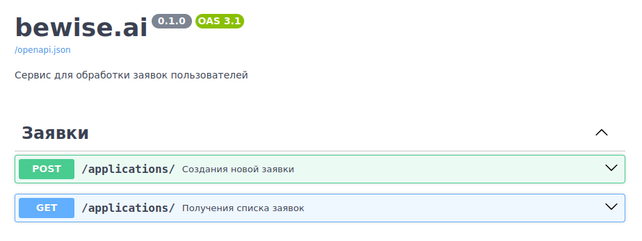
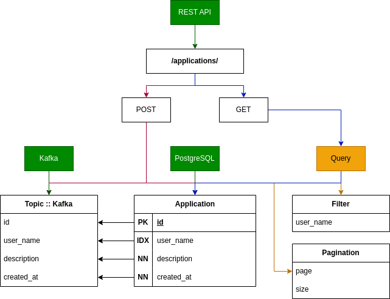

# bewise.ai

Сервис для обработки заявок пользователей - [ТЗ](./data/TestTask.pdf)

<h4>
<details>
<summary>Запуску проекта через Docker Compose</summary>
<pre>docker -v  # Docker version 27.4.1, build b9d17ea</pre>
</details>
</h4>

```commandline
docker compose up --build
```

- <strong>Документация будет доступно по ссылке: http://0.0.0.0:8000/docs</strong>
  - <details>
    <summary>POST /applications/ - Создания новой заявки</summary>
    <pre>
    curl -X 'POST' \
      'http://0.0.0.0:8000/applications/' \
      -H 'accept: application/json' \
      -H 'Content-Type: application/json' \
      -d '{
      "user_name": "Alice",
      "description": "SHA256:ZFYiILDZ0FYvzlweLAn2ORxYTicw5CeMwlq7XiSNKWs"
    }'
    ---
    {
      "id": 1,
      "user_name": "Alice",
      "description": "SHA256:ZFYiILDZ0FYvzlweLAn2ORxYTicw5CeMwlq7XiSNKWs",
      "created_at": "2025-01-16T10:35:11.332005"
    }
    </pre>
    </details>
  - <details>
    <summary>GET /applications/ - Получения списка заявок</summary>
    <pre>
    curl -X 'GET' \
      'http://0.0.0.0:8000/applications/?page=1&size=20' \
      -H 'accept: application/json'
    ---
    {
      "items": [
        {
          "id": 3,
          "user_name": "Eve",
          "description": "SHA256:C1gQKS4BZ/IiKM7FnTPADiRWhtGfdz5GLKh2C3ZCTFY",
          "created_at": "2025-01-16T10:36:24.974006"
        },
        {
          "id": 2,
          "user_name": "Bob",
          "description": "SHA256:cmCfuncROD87w/sHAYeCD8rMAZC1Ll6omubAm2R5UBs",
          "created_at": "2025-01-16T10:36:08.964033"
        },
        {
          "id": 1,
          "user_name": "Alice",
          "description": "SHA256:ZFYiILDZ0FYvzlweLAn2ORxYTicw5CeMwlq7XiSNKWs",
          "created_at": "2025-01-16T10:35:11.332005"
        }
      ],
      "total": 3,
      "page": 1,
      "size": 20,
      "pages": 1
    }
    </pre>
    </details>
- <details>
  <summary>Пример публикации данных о новых заявках</summary>
  <pre>
  docker compose exec -it bewise.ai-broker bash
  broker:/$ ./opt/kafka/bin/kafka-console-consumer.sh --bootstrap-server broker:9092 --topic Kafka
  ---
  {"id": 1, "user_name": "Alice", "description": "SHA256:ZFYiILDZ0FYvzlweLAn2ORxYTicw5CeMwlq7XiSNKWs", "created_at": "2025-01-16 10:35:11.332005"}
  {"id": 2, "user_name": "Bob", "description": "SHA256:cmCfuncROD87w/sHAYeCD8rMAZC1Ll6omubAm2R5UBs", "created_at": "2025-01-16 10:36:08.964033"}
  {"id": 3, "user_name": "Eve", "description": "SHA256:C1gQKS4BZ/IiKM7FnTPADiRWhtGfdz5GLKh2C3ZCTFY", "created_at": "2025-01-16 10:36:24.974006"}
  </pre>
  </details>
- <strong>Реализованные дополнительные функции</strong>
  - [x] Валидация входящих данных с использованием Pydantic
  - [ ] Логирование ошибок и событий в приложении
  - [ ] Подготовка unit-тестов для ключевых компонентов

---
<details>
<summary>Файловая структура проекта</summary>
<pre>
tree -a -I ".venv|__pycache__|__init__.py|.idea|.pytest_cache|data" --dirsfirst
.
├── deploy
│   ├── docker
│   │   └── restapi
│   └── secrets
│       ├── .env-kafka
│       ├── .env-postgres
│       └── .env-restapi
├── src
│   ├── core
│   │   ├── config.py
│   │   └── dependencies.py
│   ├── database
│   │   ├── app.py
│   │   ├── crud.py
│   │   └── models.py
│   ├── datastream
│   │   ├── app.py
│   │   └── publication.py
│   ├── routers
│   │   ├── application.py
│   │   ├── dependencies.py
│   │   └── schemas.py
│   └── main.py
├── docker-compose.yml
├── README.md
└── requirements.txt
</pre>
</details>

<details>
<summary>Использованные технологии</summary>
<ul>
  <li>FastAPI<sup>1</sup></li>
  <li>FastAPI Paginations<sup>2</sup></li>
  <li>SQLAlchemy<sup>3</sup></li>
  <li>PostgreSQL<sup>4</sup></li>
  <li>Kafka<sup>4</sup></li>
  <li>Docker Compose<sup>6</sup></li>
</ul>
</details>

#### Ссылки по технологиям
- <sup>1</sup>https://fastapi.tiangolo.com
- <sup>2</sup>https://uriyyo-fastapi-pagination.netlify.app/
- <sup>3</sup>https://www.sqlalchemy.org
- <sup>4</sup>https://www.postgresql.org/
- <sup>5</sup>https://kafka.apache.org
- <sup>6</sup>https://docs.docker.com/compose

---
<p align="center">Записал процесс разработки, 3-мин <a href="https://youtu.be/sS-v0bNf-ag">YouTube</a> видео!</p>
<p align="center"></p>
<p align="center"></p>
