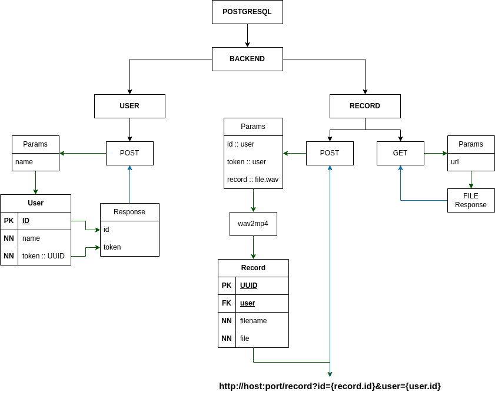

Музыкальный веб сервис - [ТЗ](../data/TestTask.pdf)<br />
Пользователям доступно загрузки и отгрузки аудиозаписей

<h4>
  <details>
    <summary>Запуску проекта через Docker Compose</summary>
    <pre>docker -v  # Docker version 27.5.1, build 9f9e405</pre>
  </details>
</h4>

```bash
docker compose up -d --build
```
- <strong>Сервис: http://0.0.0.0:8000</strong>
- <strong>Документация: http://0.0.0.0:8000/docs</strong>
  - <details>
    <summary>POST /user/ - Создание пользователя</summary>
    <pre>
    curl -X 'POST' \
      'http://localhost:8000/user/?name=ames0k0' \
      -H 'accept: application/json' \
      -d ''
    ---
    {
      "id": 1,
      "token": "d5fde0d9-9402-4112-bd33-b6ae14d8c87f"
    }</pre>
    </details>
  - <details>
      <summary>POST /record/ - Получения списка заявок</summary>
      <pre>
      curl -X 'POST' \
        'http://localhost:8000/record' \
        -H 'accept: application/json' \
        -H 'Content-Type: multipart/form-data' \
        -F 'id=1' \
        -F 'token=d5fde0d9-9402-4112-bd33-b6ae14d8c87f' \
        -F 'file=@out.wav;type=audio/x-wav'
      ---
      "http://0.0.0.0:8000/record?id=acd5f8bf-f759-4e99-8441-b4aba0a0a738&user=1"</pre>
    </details>
  - <details>
      <summary>GET /record/ - Получения списка заявок</summary>
      <pre>
      curl -X 'GET' \
        'http://localhost:8000/record?url=http://0.0.0.0:8000/record?id=acd5f8bf-f759-4e99-8441-b4aba0a0a738&user=1' \
        -H 'accept: application/json'
      ---</pre>
    </details>

---
<details>
<summary>Файловая структура проекта</summary>
<pre>
tree -a -I ".venv|__pycache__|__init__.py|pgdata" --dirsfirst
.
├── app
│   ├── routers
│   │   ├── record.py
│   │   └── user.py
│   ├── sqldb
│   │   ├── crud.py
│   │   └── models.py
│   ├── config.py
│   ├── dependencies.py
│   ├── exceptions.py
│   ├── main.py
│   └── schemas.py
├── docker-compose.yml
├── Dockerfile
├── .gitignore
├── README.md
└── requirements.txt
</pre>
</details>

<details>
<summary>Использованные технологии</summary>
<ul>
  <li>FastAPI<sup>1</sup></li>
  <li>SQLAlchemy<sup>2</sup></li>
  <li>PostgreSQL<sup>3</sup></li>
  <li>Docker Compose<sup>4</sup></li>
</ul>
</details>

#### Ссылки по технологиям
- <sup>1</sup>https://fastapi.tiangolo.com
- <sup>2</sup>https://www.sqlalchemy.org
- <sup>3</sup>https://www.postgresql.org/
- <sup>4</sup>https://docs.docker.com/compose

---
<p align="center"></p>
