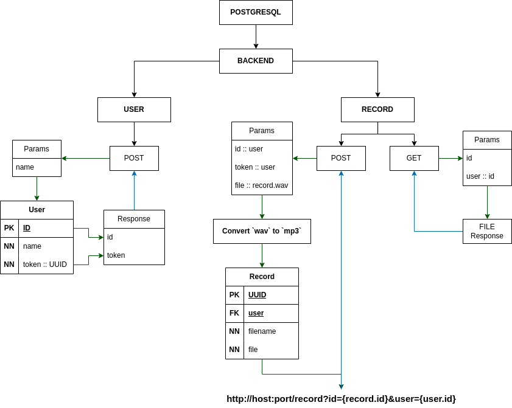

# Музыкальный веб сервис - [ТЗ](../data/TestTask.pdf)<br />

Пользователям доступно загрузки и отгрузки аудиозаписей

### Скачивание проекта
```bash
git clone \
  --single-branch \
  --depth=1 https://github.com/ames0k0/TestWork

cd TestWork/WebDevelopment/staff-prof.ru/Task_2/
```

### Запуску проекта через Docker Compose
<details>
  <summary>Зависимости</summary>
  <pre>
docker -v  # Docker version 27.5.1, build 9f9e405
python -V  # Python 3.12.3</pre>
</details>

```bash
docker compose up -d --build
```
| Сервис                | Документация / SwaggerUI   |
| --------------------- | -------------------------- |
| http://localhost:8000 | http://localhost:8000/docs |


## REST методы
### Пользователь
#### Создание пользователя
```
POST /user/
```
| Параметры запроса | Тип    | Описание         |
| ----------------- | ------ | ---------------- |
| name              | Строка | Имя пользователя |
```json
// Ответ сервера
{
  "id": 1,
  "token": "d5fde0d9-9402-4112-bd33-b6ae14d8c87f"
}
```
### Аудизапись
#### Загрузка аудиозаписи
```
POST /record/
```
| Параметры формы | Тип   | Описание                     |
| --------------- | ----- | ---------------------------- |
| id              | Число | Идентификатор пользователя   |
| token           | UUID  | Токен доступа / пользователя |
| file            | Файл  | Аудиозапись в формате `wav`  |
```json
// Ответ сервера
"http://0.0.0.0:8000/record?id=acd5f8bf-f759-4e99-8441-b4aba0a0a738&user=1"
```
#### Скачивания аудизаписа
```
GET /record/
```
| Параметры запроса | Тип    | Описание                   |
| ----------------- | ------ | -------------------------- |
| id                | UUID   | Идентификатор аудиозаписи  |
| user              | Число  | Идентификатор пользователя |
```json
// Ответ сервера
// blob:http://localhost:8000/bd03fa9f-9584-4ab6-b440-280c3b804bb2
@file
```
> [!NOTE]
> - Не преобразует айдиозапись в формат `mp3`

---
<details>
<summary>Файловая структура проекта</summary>
<pre>
tree -a -I ".venv|__pycache__|__init__.py|pgdata" --dirsfirst
.
├── app
│   ├── routers
│   │   ├── record.py
│   │   └── user.py
│   ├── sqldb
│   │   ├── crud.py
│   │   └── models.py
│   ├── config.py
│   ├── dependencies.py
│   ├── exceptions.py
│   ├── main.py
│   └── schemas.py
├── docker-compose.yml
├── Dockerfile
├── .gitignore
├── README.md
└── requirements.txt
</pre>
</details>

<details>
<summary>Использованные технологии</summary>
<ul>
  <li>FastAPI<sup>1</sup></li>
  <li>SQLAlchemy<sup>2</sup></li>
  <li>PostgreSQL<sup>3</sup></li>
  <li>Docker<sup>4</sup></li>
  <li>Docker Compose<sup>5</sup></li>
</ul>
</details>

#### Ссылки по технологиям
- <sup>1</sup>https://fastapi.tiangolo.com
- <sup>2</sup>https://www.sqlalchemy.org
- <sup>3</sup>https://www.postgresql.org
- <sup>4</sup>https://docs.docker.com
- <sup>5</sup>https://docs.docker.com/compose

---
<p align="center"></p>
